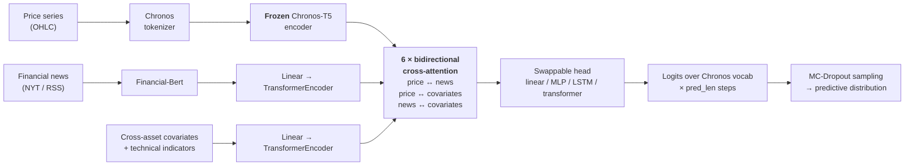

# NLP-Enabled Commodity Forecasting

**A cross-attention forecaster that fuses price history, financial news, and cross-asset
covariates on top of a frozen [Chronos-T5](https://github.com/amazon-science/chronos-forecasting)
encoder — and a controlled study of when that architecture helps, when it can't, and how to
tell the difference.**

The headline result is a negative one, established rigorously: **on daily copper (XCU),
the model cannot beat a naïve random-walk baseline — because the signal is not there to
be found.** The same model, unchanged, solves deterministic synthetic signals to ~1e-9
error and beats the baseline on a synthetic series built with genuine autocorrelation.
That contrast is the point of the project.

---

## Why this repo is worth a read

Most forecasting projects report the run that worked. This one is built around
**falsification**: every claim about the model is paired with a control that would have
caught the opposite conclusion.

| Question | How it was answered |
|---|---|
| Is the flat "predict yesterday" output a bug? | No — the identical pipeline solves SINE/SINC/SQUARE to ~1e-9 MSE. A broken model cannot do that. |
| Is the architecture capable of learning return dynamics at all? | Yes — on a synthetic AR(1)-return series (φ=0.3) it beats the naïve baseline. |
| Then why does it fail on real copper? | Because XCU's log-returns have **zero autocorrelation at every lag out to a year** — the optimal 1-step forecast genuinely *is* the last value. |
| Would more covariates fix it? | No — 49 cross-asset + 11 technical indicators made it *worse*, and the technicals are deterministic functions of price the model already sees. |

The conclusion is not "the model failed." It's **"the target is a martingale, and here is
the evidence."** That distinction is the difference between a project that overfits a
demo and one that would survive code review.

---

## Architecture

Three streams attend to each other bidirectionally, then decode into Chronos's token
vocabulary over a forecast horizon.



**Design decisions worth calling out:**

- **The Chronos encoder is frozen and pinned to `eval()`** even when the trainer flips the
  model to `train()` — freezing stops gradients but *not* dropout, and letting dropout
  perturb the frozen embeddings would silently inject noise into the one component that's
  supposed to be deterministic.
- **MC-Dropout deliberately excludes the frozen encoder**, so predictive uncertainty comes
  from the trainable fusion layers rather than from perturbing a pretrained representation.
- **Forecasting is framed as token classification**, not regression — the model predicts a
  distribution over Chronos's quantized bins per horizon step, which is what makes
  calibrated interval estimates (CRPS, WIS, coverage) available for free.
- **Zero, one, or N covariates all work.** With no covariates the model swaps in a learned
  placeholder embedding rather than special-casing the forward pass.

---

## Results

### Synthetic controls — the model works when signal exists

| Target | Structure | MSE | Skill vs. naïve |
|---|---|---:|---:|
| `SQUARE` | deterministic, periodic | 6.8e-14 | **+99.99999997%** |
| `SINC` | deterministic, periodic | 2.5e-09 | **+99.99995%** |
| `SINE` | deterministic, periodic | 5.4e-09 | **+99.99994%** |
| `AR1_RETURNS` | stochastic, **real** φ=0.3 return autocorrelation | 1.174e-04 | **+1.18%** |

The AR(1) row is the critical one: a *stochastic* series that the model still beats,
because its returns carry genuine lag-1 structure. This is the positive control that
rules out "the model can only fit smooth curves."

### Real copper (XCU) — the signal isn't there

| Config | Diff | ctx→pred | Covariates | MSE | Skill vs. naïve |
|---|---|---|---|---:|---:|
| transformer | log_diff | 365→50 | 12 cross-asset | 0.1969 | **+1.79%** |
| transformer (mini) | log_diff | 100→7 | 49 cross-asset | 0.0360 | −0.49% |
| transformer | log_diff | 30→7 | 11 technical + 6 calendar | 0.0359 | −0.19% |
| linear | log_diff | 100→7 | 49 cross-asset | 0.0377 | −5.28% |
| linear | no_diff | 100→7 | 11 technical + 49 cross-asset | 0.1497 | **−317.6%** |

Every 7-day-horizon configuration underperforms the naïve baseline. The one positive
result uses a 50-day horizon and reproduced across two independent runs — flagged as a
lead worth a dedicated horizon sweep, **not** claimed as a win.

### The explanation — XCU's autocorrelation structure

| Lag (days) | Price level ACF | Log-return ACF |
|---:|---:|---:|
| 1 | 0.9986 | −0.0042 |
| 5 | 0.9928 | −0.0069 |
| 21 | 0.9706 | −0.0100 |
| 252 | 0.6480 | −0.0001 |

Price levels are near-unit-root (a random walk). Returns are **statistically
indistinguishable from white noise at every lag** — every value sits inside the
±1.96/√N white-noise band. Under a martingale, `E[X_{t+1} | X_t] = X_t`, so
"predict yesterday" isn't the model giving up — it's the Bayes-optimal answer.

What *does* exist in XCU is **volatility clustering**: `|log-return|` autocorrelation
≈0.25 at lag 1, persisting to lag 252. That's a dispersion signal, not a directional
one — which is why the productive direction here is calibration, not point accuracy.

📊 **[Full per-run breakdown → `results/INDEX.md`](results/INDEX.md)**

---

## Quick start

```bash
git clone https://github.com/GiorOikonomidis/nlp-enabled-forecasting.git
cd nlp-enabled-forecasting
python -m venv venv && source venv/bin/activate   # Windows: venv\Scripts\activate
pip install -r model_impl/requirements.txt
```

**Step 1 — build the datasets.** The parquet trees aren't committed (too large), so
they're rebuilt from source: downloads prices and news, runs the FinBERT + MiniLM pass,
computes technical indicators, and merges everything onto one aligned calendar.

```bash
cd data_creation && pip install -e . && python -m scripts.main --dataset metals
```

Needs an `api_key.env` with an `NYT_API_KEY` for the news feed — see
`data_creation/api_key.env.example`.

**Step 2 — train and evaluate.**

```bash
python -m model_impl.main --config exampl.yaml --target-covariate-path produced_data/metals/datasets/target_variables.parquet --global-covariate-path produced_data/metals/datasets/global_covariates.parquet
```

Every run writes figures, per-window CSVs, a `config_snapshot.json` and a `summary.json`
to a timestamped output directory, and optionally logs to MLflow. Every setting has a
built-in default, so partial configs are valid — `exampl.yaml` doubles as a full
reference of every available key.

Requires Python ≥3.10. A CUDA GPU is optional — the runtime probes for one and falls back to CPU.

---

## Repo map

| Path | What it is |
|---|---|
| [`model_impl/`](model_impl/) | The model, training loop, evaluation suite. → [usage guide](model_impl/README.md) · [architecture reference](model_impl/code_structure.md) |
| [`data_creation/`](data_creation/) | Dataset pipeline: price/news download → FinBERT+MiniLM NLP pass → technical indicators → merged parquet. → [docs](data_creation/README.md) |
| [`val_data/`](val_data/) | Standalone analysis: correlation/attention studies, synthetic-signal generators, token-distribution diagnostics, data-quality checks ([`helpers_checkers/`](val_data/helpers_checkers/)), report figures ([`report_figures/`](val_data/report_figures/)), and a Monte-Carlo sampling study ([`logits_over_probs/`](val_data/logits_over_probs/monte_carlo_review.md)) |
| [`experiments/`](experiments/) | Sweep configs and generator for the 20-run study |
| [`results/`](results/) | Per-run metrics, configs and figures. → [**INDEX.md**](results/INDEX.md) |
| [`Overall.md`](Overall.md) | Project post-mortem: findings, open questions, next steps |

**Evaluation suite:** MSE · MAE · sMAPE · CRPS · WIS@50/80/90 · interval coverage ·
sharpness · quantile ECE · PIT histograms · reliability curves · Diebold–Mariano
significance testing against the naïve baseline.

---

## Honest limitations

Things a reviewer would find, listed before they have to look:

- **Calibration is not solved.** Configurations split into badly overconfident (50%
  interval covering truth 6–11% of the time) and badly underconfident (80–96%) with no
  middle ground. The driver appears to be the news-enabled/differencing interaction; it
  is diagnosed, not fixed.
- **One run's covariate accounting doesn't reconcile** — its config declares 60
  covariates while its summary reports 49. That run is excluded from conclusions until
  resolved.
- **Cross-asset covariates were selected on price *levels*, not returns.** Two random
  walks co-trend over 19 years without any predictive relationship. The correct test is
  *lagged* return cross-correlation, and it hasn't been run — so "these covariates are
  informative" remains an assumption, not a finding.
- **3 of 20 runs never completed** (two killed mid-training, one crashed early with no
  captured traceback). Retained in `results/incomplete_runs/` rather than quietly dropped.
- **News signal was not isolated.** The news pathway is implemented and exercised, but no
  ablation cleanly attributes performance change to it versus the covariate pathway.

---

## Contributors

Primary author: **Giorgos Oikonomidis** — architecture, data-creation pipeline , model implementation, evaluation
suite, experimental design and analysis.

With contributions from **Eugenia Skagkou** on the data-creation in the news fetching .

Published with permission.

---

## License

[MIT](LICENSE)
